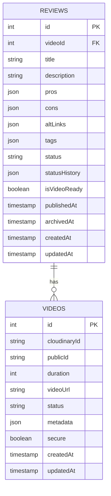

# Database Schema Documentation

This document outlines the database schema for the video review system.

## Entity Relationship Diagram

## Tables

### Videos Table

The `videos` table stores metadata for uploaded videos.

| Column | Type | Description |
|--------|------|-------------|
| id | serial | Primary key |
| cloudinaryId | text | Cloudinary resource ID (required) |
| publicId | text | Cloudinary public ID for URLs (required) |
| duration | integer | Video duration in seconds |
| videoUrl | text | URL to access the video |
| status | varchar(50) | Video processing status (default: 'ready') |
| metadata | jsonb | Video technical metadata |
| secure | boolean | Use HTTPS URLs (default: true) |
| createdAt | timestamp | Record creation timestamp |
| updatedAt | timestamp | Record update timestamp |

#### Video Metadata Structure
The metadata JSON object includes:
- format: Video format (mp4, webm, etc)
- codec: Video codec used
- bitRate: Video bitrate
- width: Video width
- height: Video height
- fps: Frames per second
- audioCodec: Audio codec
- audioFrequency: Audio sample rate
- aspectRatio: Video aspect ratio
- rotation: Video rotation
- quality: Quality score

### Reviews Table

The `reviews` table stores video reviews with references to uploaded videos.

| Column | Type | Description |
|--------|------|-------------|
| id | serial | Primary key |
| videoId | integer | Foreign key reference to videos table (required) |
| title | varchar(255) | Review title (optional) |
| description | text | Review description (optional) |
| pros | jsonb | List of positive points |
| cons | jsonb | List of negative points |
| altLinks | jsonb | Alternative links related to the review |
| tags | jsonb | Review tags |
| status | varchar(50) | Review status (default: 'video_uploaded') |
| statusHistory | jsonb | Track status changes |
| isVideoReady | boolean | Indicates if video is ready (default: false) |
| publishedAt | timestamp | When the review was published |
| archivedAt | timestamp | When the review was archived |
| createdAt | timestamp | Record creation timestamp |
| updatedAt | timestamp | Record update timestamp |

#### Review Status Types
Available status values:
- video_uploaded
- draft
- in_review
- published
- archived
- deleted

## Relationships

- Each review must be associated with exactly one video (1:1)
- A video can have multiple reviews (1:N)
- The `videoId` in the reviews table is a foreign key that references the `id` in the videos table 